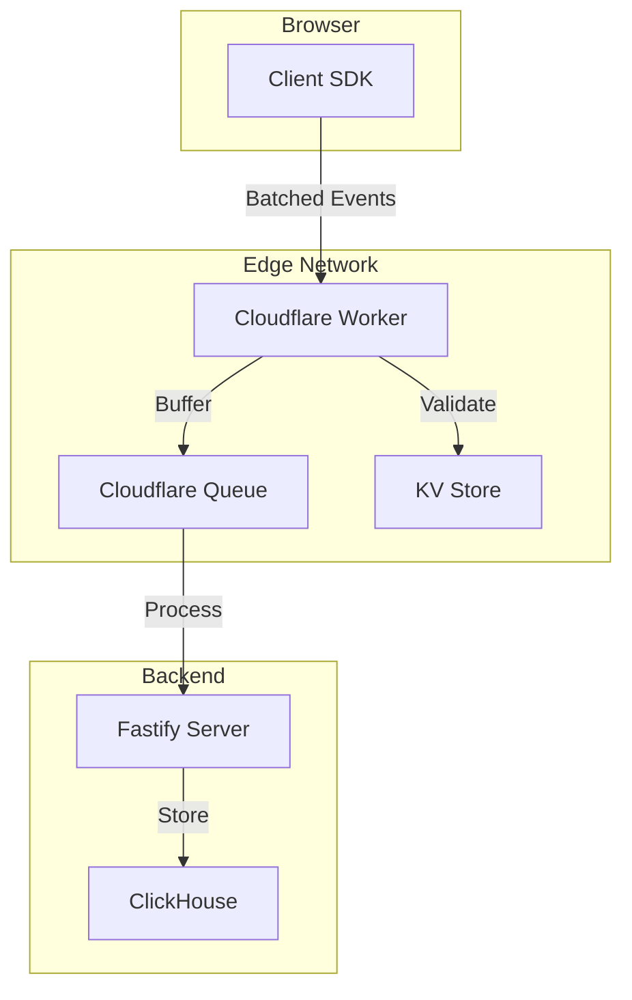

# Observability Platform

A high-performance, privacy-focused observability platform for modern web applications. Built with edge computing principles, real-time data ingestion, and comprehensive analytics capabilities.

## 🚀 Overview

This observability platform provides end-to-end monitoring for web applications with minimal performance overhead. It captures user interactions, performance metrics, errors, and custom events while respecting user privacy.

### Key Features

- **Lightweight Client SDK** - < 10KB gzipped, zero dependencies
- **Edge-First Architecture** - Cloudflare Workers for global low-latency ingestion
- **Real-Time Processing** - Stream processing with batching and compression
- **Privacy by Design** - GDPR compliant, no PII collection by default
- **Comprehensive Metrics** - Web Vitals, user interactions, errors, custom events
- **High Performance Storage** - ClickHouse for analytical queries at scale

## 📦 Repository Structure

```
observability/
├── apps/
│   ├── server/          # Fastify API server for event processing
│   └── demo/            # Next.js demo application
├── packages/
│   ├── observability/   # Client SDK for browser tracking
│   ├── clickhouse/      # Database client and migrations
│   ├── schemas/         # Shared TypeScript schemas
│   └── typescript-config/ # Shared TypeScript configurations
└── workers/
    └── ingestion/       # Cloudflare Worker for event ingestion
```

## 🏗️ Architecture



### Data Flow

1. **Collection** - Client SDK captures events in the browser
2. **Batching** - Events are batched and compressed client-side
3. **Ingestion** - Cloudflare Worker validates and buffers events
4. **Processing** - Server consumes queue and transforms data
5. **Storage** - ClickHouse stores data for analytical queries

## 🚦 Quick Start

### Prerequisites

- Node.js 18+ and pnpm 8+
- ClickHouse server (local or cloud)
- Cloudflare account (for Worker deployment)
- Git

### Installation

```bash
# Clone the repository
git clone https://github.com/yourusername/observability.git
cd observability

# Install dependencies
pnpm install

# Setup environment variables
cp packages/clickhouse/.env.example packages/clickhouse/.env
# Edit .env with your ClickHouse credentials
```

### Development Setup

```bash
# Start ClickHouse (requires sudo on macOS/Linux)
pnpm --filter @observability/clickhouse clickhouse:start

# Run database migrations
pnpm --filter @observability/clickhouse migrate:up

# Start all services in development mode
pnpm dev
```

This starts:
- Demo app: http://localhost:3000
- API server: http://localhost:3001
- Cloudflare Worker: http://localhost:8787

### Testing the Platform

1. Open the demo app at http://localhost:3000
2. Interact with the page (click, scroll, navigate)
3. Check the browser console for SDK logs
4. View events in the server logs & clickhouse database

## 📖 Package Documentation

### Client SDK (`packages/observability`)
The browser SDK that captures events and metrics. [View Documentation](packages/observability/README.md)

```javascript
import Observability from '@observability/observability';

const obs = new Observability({
  apiKey: 'your-api-key',
  endpoint: 'https://your-worker.workers.dev'
});

// Track custom events
obs.track('purchase', { amount: 99.99 });
```

### Ingestion Worker (`workers/ingestion`)
Edge worker for high-throughput event ingestion. [View Documentation](workers/ingestion/README.md)

### API Server (`apps/server`)
Fastify server for event processing and storage. [View Documentation](apps/server/README.md)

### ClickHouse Package (`packages/clickhouse`)
Database client and migration tools. [View Documentation](packages/clickhouse/README.md)

### Demo Application (`apps/demo`)
Example Next.js application with SDK integration. [View Documentation](apps/demo/README.md)

## 🚀 Deployment

### 1. Deploy ClickHouse

#### Option A: Self-Hosted
```bash
# Install ClickHouse
curl https://clickhouse.com/ | sh

# Start service
sudo clickhouse start

# Run migrations
pnpm --filter @observability/clickhouse migrate:up
```

#### Option B: ClickHouse Cloud
1. Create account at [clickhouse.cloud](https://clickhouse.cloud)
2. Create a service
3. Update `.env` with connection details

### 2. Deploy Cloudflare Worker

```bash
cd workers/ingestion

# Login to Cloudflare
pnpm wrangler login

# Configure KV namespace
pnpm wrangler kv:namespace create "ALLOWED_ORIGINS"

# Update wrangler.toml with KV namespace ID

# Deploy worker
pnpm deploy
```

### 3. Deploy API Server

#### Option A: Docker
```bash
# Build image
docker build -t observability-server apps/server

# Run container
docker run -p 3001:3001 \
  -e DATABASE_URL=your-clickhouse-url \
  observability-server
```

#### Option B: Node.js
```bash
# Build server
pnpm --filter @observability/server build

# Start production server
NODE_ENV=production pnpm --filter @observability/server start
```

### 4. Configure SDK

Update your application with the deployed endpoints:

```javascript
const obs = new Observability({
  apiKey: 'your-production-key',
  endpoint: 'https://your-worker.workers.dev',
  environment: 'production'
});
```

## 🔧 Configuration

### Environment Variables

#### Server (`apps/server/.env`)
```env
PORT=3001
DATABASE_URL=clickhouse://localhost:8123
QUEUE_URL=https://your-queue.cloudflare.com
API_KEY=your-secret-key
```

#### ClickHouse (`packages/clickhouse/.env`)
```env
CLICKHOUSE_HOST=localhost
CLICKHOUSE_PORT=8123
CLICKHOUSE_USER=default
CLICKHOUSE_PASSWORD=
CLICKHOUSE_DATABASE=observability
```

#### Worker (`workers/ingestion/wrangler.toml`)
```toml
name = "observability-ingestion"
main = "src/index.ts"
compatibility_date = "2024-01-01"

[[kv_namespaces]]
binding = "ALLOWED_ORIGINS"
id = "your-kv-namespace-id"

[[queues.producers]]
binding = "EVENT_QUEUE"
queue = "observability-events"
```

## 📊 Monitoring & Operations

### Health Checks

```bash
# Check server health
curl http://localhost:3001/health

# Check ClickHouse connection
curl http://localhost:8123/ping

# Check Worker status
curl https://your-worker.workers.dev/health
```

### Database Operations

```bash
# Create new migration
pnpm --filter @observability/clickhouse migrate:create my_migration

# Rollback migration
pnpm --filter @observability/clickhouse migrate:down

# Seed sample data
pnpm --filter @observability/clickhouse seed
```

### Performance Tuning

#### Client SDK
- Adjust batch size: `batchSize: 100`
- Modify flush interval: `flushInterval: 10000`
- Enable compression: `compression: true`

#### ClickHouse
- Configure merge tree settings for optimal performance
- Set up materialized views for common queries
- Implement data retention policies

## 🧪 Testing

```bash
# Run all tests
pnpm test

# Run specific package tests
pnpm --filter @observability/observability test
pnpm --filter @observability/server test

# Run with coverage
pnpm test:coverage

# Run with UI
pnpm test:ui
```

## 🛠️ Development

### Commands

```bash
# Install dependencies
pnpm install

# Build all packages
pnpm build

# Run development servers
pnpm dev

# Type checking
pnpm typecheck

# Linting
pnpm lint

# Format code
pnpm format
```

### Project Structure

- **Monorepo**: Managed with pnpm workspaces
- **Build System**: Turbo for caching and orchestration
- **Code Style**: Biome for formatting and linting
- **TypeScript**: Strict mode with shared configs
- **Testing**: Vitest for unit and integration tests

## 📈 Performance

### SDK Performance
- **Size**: < 10KB gzipped
- **CPU**: < 1% impact on main thread
- **Memory**: < 1MB heap usage
- **Network**: Batched requests every 5s

### Ingestion Performance
- **Throughput**: 100,000+ events/second per worker
- **Latency**: < 50ms p99 globally
- **Availability**: 99.99% uptime SLA

### Query Performance
- **Simple queries**: < 100ms
- **Aggregations**: < 500ms for millions of events
- **Real-time**: < 1s data availability

## 🔒 Security

### Data Privacy
- No PII collection by default
- IP anonymization
- User consent management
- GDPR/CCPA compliant

### Security Features
- API key authentication
- Origin validation
- Rate limiting
- Data encryption in transit
- Secure cookie handling